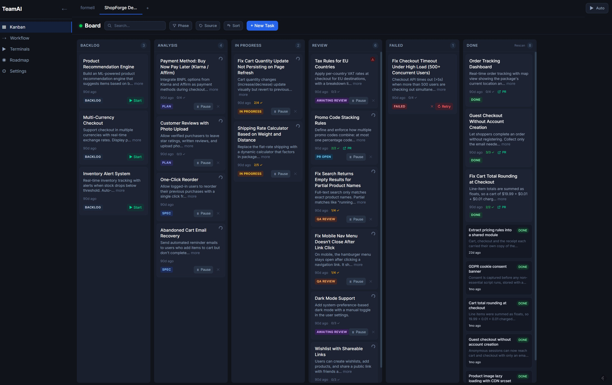

# TeamAI

Multi-agent [Claude Code](https://docs.anthropic.com/en/docs/claude-code) orchestrator — an Electron desktop app that runs parallel Claude CLI agents through automated software development pipelines.



## Features

### Sidebar sections (currently visible)

| Section | Route | Description |
|---|---|---|
| **Kanban** | `/` | Drag-and-drop task board spanning all pipeline phases (`backlog` → `done`) with task detail, review, and retry actions |
| **Workflow** | `/workflow` | Pipeline orchestration view showing how tasks advance through spec → plan → implement → QA review → merge |
| **Terminals** | `/terminals` | Unified terminal UI (xterm.js) streaming live agent session output |
| **Roadmap** | `/roadmap` | Long-horizon roadmap planning view |
| **Settings** | `/settings` | Project configuration: LLM providers, pipeline phases, auto mode, and the Role Refinement Assistant |

### Core platform features

- **Multi-agent pipeline** — role-specialized Claude agents (analyst, planner, coder, qa-reviewer, merger) drive each task through spec → plan → implement → QA review → merge
- **Auto Mode** — automatically advances tasks: picks backlog tasks, auto-approves reviews, creates PRs, polls CI, and auto-merges. State persists across restarts
- **Role Refinement Assistant** — analyzes failed tasks and suggests role-prompt improvements (with auto-apply + auto-retry as opt-in)
- **Git worktree isolation** — parallel agents run in isolated git worktrees, preventing file conflicts
- **Multi-project support** — manage multiple target codebases, each with its own `.teamai/` state and `.claude/` config
- **Crash recovery** — interrupted tasks and rate-limited sessions auto-resume on restart

## Install

Download the latest build for your platform from [Releases](https://github.com/vmorenoluna/TeamAI/releases) — Windows (`.exe` installer), macOS (`.dmg`), or Linux (`.AppImage` / `.deb`). Installed builds check for updates automatically; see [Auto-Updates](#auto-updates) below for per-platform coverage and the unsigned-binary warnings you'll see on first launch.

Either way you install it — packaged build or from source below — TeamAI needs the Claude Code CLI and a Claude account to actually run anything; see Prerequisites.

To build and run from source instead, see [Quick Start](#quick-start).

## Prerequisites

Required regardless of install method:

- **A Claude account** (or Claude API key) — TeamAI spawns `claude` CLI subprocesses to run agents; without one, nothing runs.
- **Claude Code CLI** — `npm install -g @anthropic-ai/claude-code`

Only needed if building/running from source (not for a packaged download):

- **Node.js** ≥ 20
- **Git**
- **Docker** (optional — for container-isolated agent sessions)

## Safety & Privacy

TeamAI's agents execute shell commands with the same filesystem access as the user running the app — this is inherent to how it works (an autonomous coding-agent orchestrator), not a bug. Everything runs **locally**; nothing is sent anywhere except your own configured LLM provider.

If you're pointing TeamAI at an untrusted repository (code you didn't write and haven't reviewed), enable the optional Docker devcontainer sandboxing (`container.json` — see [Configuration](#configuration)) so agent sessions run isolated from your host filesystem instead of directly on it.

## Quick Start

```bash
git clone https://github.com/vmorenoluna/TeamAI.git
cd TeamAI

# Set up git hooks
git config core.hooksPath .husky

# Install and run
cd teamai
npm install
npm run dev          # start dev server (React HMR on :3002)
npm run electron:dev  # launch Electron app (separate terminal)
```

Open `http://localhost:3002` in a browser, or run `npm run electron:dev` to open the Electron app (both connect to the dev server on :3002).

### Demo Project

TeamAI ships with a demo project (`demo/`) that includes pre-seeded tasks across all pipeline phases. The demo is **not shown by default** in production — it only appears when the server is started with the `--with-demo` flag:

```bash
# Start the dev server with the demo project
cd teamai
npm run dev -- -- --with-demo

# Start the production server with the demo project
npm run start -- -- --with-demo
```

`npm run electron:dev` already passes `--with-demo` internally, so the demo is visible when developing in Electron. For production builds (`npm run electron:start`), the demo is hidden unless you explicitly add it via the "+" button in the project selector.

## Auto-Updates

Packaged builds from [Releases](https://github.com/vmorenoluna/TeamAI/releases) check for updates automatically and prompt in-app when one is ready to install. Auto-update coverage differs by platform/format:

| Platform | Format | Auto-updates? |
|---|---|---|
| Windows | NSIS installer (`.exe`) | ✅ |
| Windows | Portable zip | ❌ — re-download manually |
| macOS | `.dmg` / `.zip` | ✅ |
| Linux | AppImage | ✅ |
| Linux | `.deb` | ❌ — re-download manually |

Builds are currently unsigned, so first launch may show a warning:
- **Windows**: SmartScreen — click "More info" → "Run anyway"
- **macOS**: Gatekeeper — right-click the app → "Open" (instead of double-clicking)

## Commands

All commands run from `teamai/`.

### Development

| Command | Description |
|---|---|
| `npm run dev` | Start Next.js dev server with HMR |
| `npm run electron:dev` | Launch Electron app pointing at the dev server |
| `npm run start` | Start production server |
| `npm run electron:start` | Launch Electron app in production mode |

### Testing

#### Quick reference

| Command | Description |
|---|---|
| `npm test` | Run all unit + integration tests (Vitest) |
| `npm run test:unit` | Run only unit tests |
| `npm run test:integration` | Run only integration tests |
| `npm run test:e2e` | Run Playwright E2E tests |
| `npm run test:all` | Full suite: typecheck + lint + vitest + e2e + changelog |
| `npm run test:changelog` | Run CHANGELOG parsing tests |
| `npm run test:watch` | Run tests in watch mode |
| `npx playwright test tests/e2e/update-banner.spec.ts` | Run a single E2E spec |

#### Test layers

| Layer | Framework | Location | Runs real CLI? | Runs Docker? |
|---|---|---|---|---|
| **Unit** | Vitest + jsdom/happy-dom | `tests/unit/` | No | No |
| **Integration** | Vitest | `tests/integration/` | No (mocked) | No |
| **E2E** | Playwright | `tests/e2e/` | No — uses seeded fixture data | No |

#### E2E test strategy

The E2E tests cover ~270 UI interactions across 33 spec files. They **do not** invoke the real Claude Code CLI or Docker — instead they run against a Next.js server with pre-seeded static fixture data.

**Seed data** (`tests/e2e/seed.ts`) creates a fake project with 16 tasks spanning all pipeline phases (`backlog` → `done`). Each task includes pre-written artifacts that simulate real pipeline output:

| Artifact | Simulates |
|---|---|
| `task.json` | Task metadata, phase, timestamps |
| `spec.md` | Specification written by the analyst agent |
| `plan.json` | Subtask plan written by the planner agent |
| `qa_report.json` | QA review results (pass/fail) |
| `completion_summary.md` | Final summary after pipeline completion |
| `events.jsonl` | Phase-change event history |
| `session_map.json` | Active pipeline session marker |

**Route mocking** — `page.route()` intercepts server action POSTs in error-path tests (e.g., forcing `InsightsChat` to show error banners when session creation fails).

**What E2E tests cover** — everything the user sees: kanban board, task detail panel, settings, workflow view, roadmap, insights dashboard, terminal UI, error banners, sidebar navigation, responsive viewport, drag-and-drop, search/filter, and more.

**What E2E tests don't cover** — anything requiring the real CLI: pipeline execution, live terminal output, WebSocket streaming from agents, Docker container management, GitHub PR creation, auto-mode processing.

**Port isolation** — the E2E server runs on port **3001**, separate from the dev server (**3002**) and production server (**3000**), so `npm run dev` and `npm run test:e2e` can run side by side.

**UI selectors** — components use `data-component="..."` attributes for stable test selectors instead of `data-testid`. Playwright and Testing Library are both configured to use `data-component` via `testIdAttribute`.

**Parallel isolation** — the seed data is cloned per Playwright worker to prevent mutation races between parallel test files.

#### Running E2E tests locally

```bash
# Run a single spec (always run E2E by file — never all at once, they take too long)
npx playwright test tests/e2e/kanban-behaviors.spec.ts

# Run with visible browser for debugging
npx playwright test tests/e2e/sidebar.spec.ts --headed

# Run a specific test within a file
npx playwright test tests/e2e/settings.spec.ts -g "Updates"
```

#### Full suite (CI equivalent)

```bash
npm run test:all
# Runs: typecheck → lint → vitest (unit + integration) → e2e → changelog
```

### Linting & Type Checking

| Command | Description |
|---|---|
| `npm run lint` | ESLint with zero-warnings enforcement |
| `npm run typecheck` | TypeScript type checking (`tsc --noEmit`) |

### Building

| Command | Description |
|---|---|
| `npm run build` | Production Next.js build |
| `npm run build:server` | Bundle the custom server with esbuild |
| `npm run electron:build` | Build Windows installer (NSIS + zip) |
| `npm run electron:build:mac` | Build macOS installer (DMG + zip) |
| `npm run electron:build:linux` | Build Linux packages (AppImage + deb) |
| `npm run electron:build:all` | Build all three platforms |

### Release

```bash
# 1. Update teamai/CHANGELOG.md with changes since last release
# 2. Run the release script
./scripts/release.sh 0.2.0

# 3. Push — the tag triggers CI to build installers + create a GitHub Release
git push origin main && git push origin v0.2.0
```

The CI workflow (`.github/workflows/release.yml`):

- Validates the tag matches `package.json` version
- Builds Windows, macOS, and Linux installers in parallel
- Creates a GitHub Release with the changelog section + auto-generated PR notes
- Marks `0.x` versions as prereleases automatically
- Uploads `latest.yml` metadata for [electron-updater](https://www.electron.build/auto-update) auto-update support

See `scripts/release.sh` for the version-bump-and-tag helper.

## Project Structure

```
teamai/
├── electron/              # Electron main process + preload
│   ├── main.js            # App lifecycle, server spawn, auto-updater
│   └── preload.js         # IPC bridge (contextBridge)
├── src/
│   ├── app/               # Next.js pages + server actions
│   ├── components/        # React components (kanban, task panel, terminals)
│   ├── hooks/             # Custom hooks
│   ├── lib/               # Core logic (orchestrator, process manager, task store)
│   └── constants/         # Phase labels, colours
├── defaults/              # Pipeline configs, command templates, role personas
├── tests/
│   ├── unit/              # Vitest unit tests
│   ├── integration/       # Vitest integration tests
│   └── e2e/               # Playwright E2E tests
├── scripts/               # Utility scripts (release.sh, test helpers)
├── server.ts              # Custom HTTP + WebSocket server
├── package.json
├── tsconfig.json
├── eslint.config.mjs
└── vitest.workspace.ts
```

## Architecture

**Pipeline:** Each task flows through configurable phases — spec → plan → implement → QA review → merge. Role-specialized Claude agents (analyst, planner, coder, qa-reviewer, merger) handle each phase.

**Commands vs. roles:** Agent prompts ship in two forms under `defaults/` and are scaffolded into each project's `.claude/` directory. **Commands** (`commands/*.md`) are the orchestration contract — the artifact schemas, output formats, and environment rules the pipeline depends on; they're force-synced across projects at startup (overwriting any customization) and the changes are surfaced as an informational banner. **Roles** (`roles/*.md`) are agent personas and project conventions, scaffolded once and left for you to customize. Rewriting a role never breaks the pipeline — the load-bearing rules all live in the commands.

**ProcessManager:** Spawns `claude -p --input-format stream-json --output-format stream-json` subprocesses. NDJSON output is parsed and streamed to the UI via WebSocket.

**Git worktree isolation:** Parallel agents run in isolated git worktrees at `worktrees/<task-slug>/`, preventing file conflicts.

**Auto mode:** Optionally auto-advances tasks through the pipeline — picks backlog tasks, auto-approves reviews, creates PRs, polls CI, and auto-merges. State persists across restarts.

**Recovery:** On startup, detects interrupted tasks and stale sessions. Rate-limited sessions auto-resume with a countdown timer.

**Electron:** In dev mode, `Ctrl+Shift+U` simulates the update download → ready flow for testing the update banner.

## Configuration

Per-project `.teamai/` directory:

| File | Purpose |
|---|---|
| `providers.json` | LLM backend per role (Anthropic, Bedrock, Vertex, OpenAI, Gemini, Ollama) |
| `pipeline.json` | Phase order and max QA retry attempts |
| `container.json` | Enable/disable Docker devcontainer sandboxing |

Default configs live in `defaults/` and are synced to projects on startup.

## TODO

Features temporarily hidden from the sidebar (routes still exist and can be re-enabled by adding them back to the nav list in `src/components/sidebar.tsx`):

- [ ] **GitHub** (`/github`) — import tasks from GitHub issues
- [ ] **Analytics** (`/analytics`) — agent performance, pipeline bottlenecks, and QA trends dashboard
- [ ] **Insights** (`/insights`) — pipeline analytics (completion rate, phase distribution) and project chat
- [ ] **Ideation** (`/ideation`) — scan the codebase for improvements, vulnerabilities, and tech debt

## Contributing

See [CONTRIBUTING.md](CONTRIBUTING.md). See `teamai/CLAUDE.md` for AI coding guidance and `teamai/AGENTS.md` for dev shortcuts.
